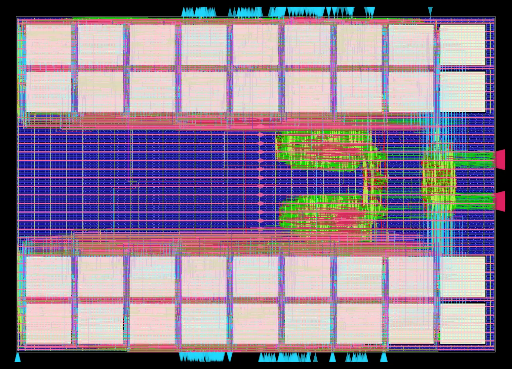

# Dual-L1 Coherent Cache

A SystemVerilog implementation of **two 16 KiB direct-mapped L1 caches** with
render-time selectable **MESI or MSI coherence**. The project combines RTL
verification, gem5 trace-driven profiling, and physical-design optimization
with OpenROAD and Nangate45, reaching approximately **850 MHz** in static
timing analysis.



*OpenROAD physical implementation: cache 0 SRAMs at the top, cache 1 SRAMs at
the bottom, and an open central region for control logic.*

## Architecture

- **32 KiB total data capacity:** two independent 16 KiB direct-mapped caches,
  each with 256 lines of 64 bytes.
- **64-bit accesses:** eight words per cache line, with separate ready/valid
  request and response interfaces.
- **Blocking CPU interfaces:** each cache completes its current request before
  accepting the next, while the two caches operate concurrently.
- **Snooping coherence:** MESI and MSI share controller interfaces and are
  selected during Jinja RTL rendering. MOESI is not implemented.
- **Remote-operation priority:** conflicting snoops take precedence over local
  updates; local coherence decisions are re-evaluated when necessary.
- **Banked storage:** synchronous SRAMs hold data and tags; flip-flops hold
  coherence state. Simulation uses BaseJump memory models, while synthesis
  maps storage to Nangate45 `fakeram45_128x64` macros.

The integrated test system includes bus arbitration, snoop responders, and a
shared backend memory path. No CPU core is required to exercise the caches.

## Physical implementation

The Yosys/Slang and OpenROAD flow targets **Nangate45**. RTL timing work separates
data selection from deep control logic. The floorplan groups each cache's
18 SRAM macros into two rows of nine, above and below the control region,
with a core height-to-width aspect ratio of **0.70**.

The resulting implementation achieves approximately **850 MHz** in STA. This
is a modeled physical-design result, not a measured silicon frequency:
FakeRAM timing models and an optimistic **20 ps input/output delay** represent
the SRAMs and the boundary to an absent CPU core. The checked-in
[SDC](openroad/top_module.sdc) specifies a 1.18 ns clock period (about 847 MHz).

## MESI versus MSI: trace-driven profiling

Static memory-access traces generated with **gem5** are replayed into the RTL
using independent cocotb drivers. Each driver respects backpressure and waits
for its previous response before issuing another request. The control workload
drives only cache 0; cache 1's CPU interface remains idle.

| Access pattern | MSI cycles | MESI cycles | MESI cycle reduction |
| --- | ---: | ---: | ---: |
| Private read/write — separate cache lines | 439,035 | 358,523 | **18.34%** |
| Control — single-cache reads | 50,054 | 50,045 | 0.018% |
| Contended — reader/writer on the same line | 380,045 | 380,033 | 0.003% |

MESI's **Exclusive (E)** state explains the private read/write improvement.
An unshared read fill can enter E, allowing a subsequent write to transition
silently from **E to Modified (M)**. MSI instead installs the read line in
**Shared (S)** and must issue `BusUpgr` before writing, even if no other cache
currently holds it. Avoiding those upgrades saves bus traffic and contention.
Writes to genuinely shared S lines require an upgrade under **both** protocols,
which is why MESI provides little benefit in the contended case.

Cycles run from completion of reset to the last CPU response across the active
drivers; they exclude a final dirty-cache flush. Reduction is
`(MSI cycles - MESI cycles) / MSI cycles`. Workloads have different request
counts, so compare protocols within each row.

Traces contain operation, address, and byte size, but no timestamps or data.
Replay covers the aligned 64-bit words touched by each access, uses zero-valued
writes, and drains reads without checking their values. These results measure
**cache traffic performance**, not full application runtime or data correctness.

## Verification

The Verilator/cocotb framework provides two complementary levels of checking:

- **Per-module unit tests** exercise protocol decisions, local/global coherence
  controllers, arbitration, cache storage/commit, and backend transactions.
  RTL templates register their tests with the renderer; the unit-test runner
  executes them independently.
- **End-to-end tests** check read/write behavior, line fills, dirty evictions,
  data preservation, and interactions between both caches. The concurrency
  timing sweep covers read/read, read/write, write/read, and write/write pairs
  with request offsets from **0 through 300 cycles**, including simultaneous
  requests and pending-upgrade re-evaluation.

The same sweep selects six initial-state pairs from `rtl/config.json`: MESI
uses `II`, `SS`, `MI`, `IM`, `EI`, and `IE`; MSI replaces `EI`/`IE` with `SI`/`IS`.
That gives **7,224 scenario/offset combinations per protocol**. Functional
verification is separate from the traffic-only profiling experiment.

## Getting started

### Prerequisites

- Git, GNU Make, Python 3, and a C++ build toolchain.
- Verilator; the Makefile supports an OSS CAD Suite installation at
  `/opt/oss-cad-suite` or a custom `OSS_CAD_SUITE` path.
- For physical implementation: Docker and a local OpenROAD-flow-scripts
  checkout, with an image containing OpenROAD, Yosys/Slang, and Nangate45.

From the repository root:

```sh
git submodule update --init --recursive
make setup
```

`make setup` creates `venv/` and installs the pinned Python dependencies. The
Makefile uses this environment automatically.

### Configure and simulate

Edit [rtl/config.json](rtl/config.json). For the MESI simulation workflow, set
the following fields while retaining the other configuration entries:

```json
{
  "RENDER_OPTION": { "SYNTH": false },
  "COH_PROTOCOL": { "MESI": true, "MSI": false, "MOESI": false }
}
```

Keep `UART0.ENABLE` false. To select MSI, set `MESI` false and `MSI` true;
enable exactly one supported protocol. Configuration is resolved at rendering
time, not switched at runtime.

```sh
make lint
make unit-test
make test-cocotb

# Run only the end-to-end concurrency sweep, without waveform output.
make test-cocotb COCOTB_TEST_FILTER=e2e_request_offset_sweep USER_SIM_ARGS=''
```

Start with MESI for the full regression; the protocol-aware timing sweep can
also be run with MSI selected. Rendering happens automatically when inputs
change. Edit sources under `rtl/`, not generated files under `build/rtl/`.
Test outputs are under `build/unit-test/` and `build/cocotb-rtl/`.

The `profiling()` block in [topmod_tb0.py](dv/cocotb_benches/topmod_tb0.py) is
currently commented out to keep profiling separate from regression tests.
To repeat the experiment, restore that block and its decorators, provide the
locally generated traces under `dv/cocotb_benches/traces/<workload>/` as
`<workload>_l1d_cpu0.txt` and `...cpu1.txt` (CPU 0 only for `control`), then run:

```sh
make test-cocotb COCOTB_TEST_FILTER=profiling USER_SIM_ARGS=''
```

Each trace row is `R/W hexadecimal-address decimal-size-in-bytes`. Trace files
are ignored by Git and must be supplied separately. Run once per protocol with
identical traces and compare the logged `total_cycles` values.

### Run OpenROAD

Set `RENDER_OPTION.SYNTH` to **true** before physical implementation. The
checked-in OpenROAD source list targets MESI; keep MESI selected for this flow.
Simulation requires **false**, and the test targets reject synthesis mode.

```sh
# Substitute your local OpenROAD-flow-scripts checkout and installed image.
make orfs ORFS_HOME=/path/to/OpenROAD-flow-scripts \
    ORFS_IMAGE=openroad/orfs:latest DEFAULT_GOAL=floorplan

# Full flow, including headless report-image generation for SSH/tmux sessions.
make orfs ORFS_HOME=/path/to/OpenROAD-flow-scripts \
    ORFS_IMAGE=openroad/orfs:latest \
    DEFAULT_GOAL='all QT_QPA_PLATFORM=offscreen'
```

Available stopping points are `synth`, `floorplan`, `place`, `cts`, `route`,
`finish`, and `all`. Passing the Qt option through `DEFAULT_GOAL` ensures it
reaches Make **inside Docker**, without requiring an authorized desktop display.

[openroad/config.mk](openroad/config.mk) controls the platform, floorplan,
source list, and run variant. [sram_placement.tcl](openroad/sram_placement.tcl)
fixes the SRAM groups in place. Logs, reports, and results are collected under
`openroad/output/`, with the current variant named `simple_cache`.

`make clean` removes generated simulation and OpenROAD output; save any results
you want to retain before running it.

## Source map

| Location | Purpose |
| --- | --- |
| [rtl/](rtl/) | Cache RTL, protocol logic, configuration, and source manifest |
| [dv/cocotb_benches/](dv/cocotb_benches/) | Unit tests, end-to-end checks, and trace replay |
| [dv/cocotb_wrappers/](dv/cocotb_wrappers/) | Module-level verification wrappers |
| [misc/rtl_renderer.py](misc/rtl_renderer.py) | Jinja RTL rendering and test registration |
| [misc/unit-test.py](misc/unit-test.py) | Registered module-test runner |
| [openroad/](openroad/) | Physical-design configuration, constraints, and SRAM placement |
| [third_party/](third_party/) | BaseJump STL and Taxi dependencies |
